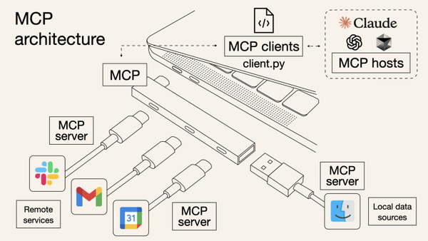

# MCP(Model Context Protocol)란?

MCP는 AI 모델과 데이터 소스 간의 안전하고 표준화된 통신을 위한 개방형 프로토콜입니다.

## 1. MCP의 핵심 개념

MCP(Model Context Protocol)는 AI 모델과 데이터 소스 간의 안전하고 표준화된 통신을 위한 개방형 프로토콜입니다.
USB-C가 다양한 기기를 연결하는 것처럼, MCP는 AI 애플리케이션과 다양한 데이터 소스를 연결하는 표준화된 인터페이스를 제공합니다.

## 2. MCP의 핵심 구성 요소

### 2.1 Resources (리소스)
- 데이터를 제공하는 엔드포인트
- 읽기 전용 데이터 접근
- 예: 파일 내용, API 응답, 데이터베이스 조회

### 2.2 Tools (도구)
- AI가 실행할 수 있는 함수
- 작업 수행 및 상태 변경 가능
- 예: API 호출, 데이터 업데이트, 계산 수행

### 2.3 Prompts (프롬프트)
- AI와의 상호작용을 위한 템플릿
- 사용자 정의 명령어 및 메뉴 옵션
- 예: 슬래시 명령어, 대화 템플릿

## 2. MCP vs 전통적인 API

### MCP의 장점
- 표준화된 인터페이스
- 마이크로서비스 아키텍처 지원
- 효율적인 리소스 관리
- 현대적이고 가벼운 프로토콜 사용

위 명령어를 통해 MCP Inspector를 활용할 수 있습니다.
참고링크: https://modelcontextprotocol.io/docs/tools/inspector
