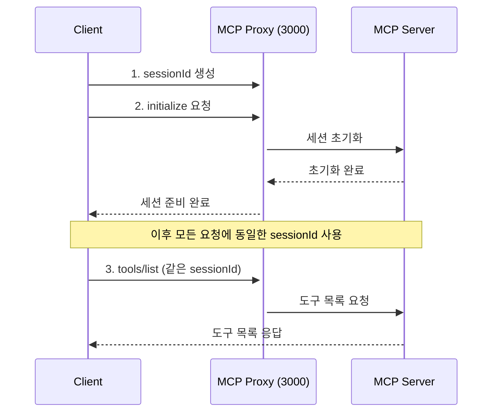

# MCP Inspector를 활용한 테스트

## 1. MCP Inspector 소개

MCP Inspector는 MCP 서버의 기능을 테스트하고 디버깅하기 위한 웹 기반 도구입니다.

### 1.1 주요 기능
- 리소스 탐색 및 테스트
- 도구 실행 및 결과 확인
- 프롬프트 템플릿 테스트
- 실시간 로그 확인

## 2. MCP 서버 구현

### 2.1 기본 서버 코드
```python
# country_server.py
from mcp.server.fastmcp import FastMCP

# 간단한 "국가-수도" 데이터베이스
capitals = {
    "대한민국": "서울",
    "미국": "Washington, D.C.",
    "프랑스": "Paris",
    "일본": "Tokyo",
}


# MCP 서버 생성
mcp = FastMCP("CountryInfo")

# 1. Resource: 모든 국가 리스트 제공
@mcp.resource("countries://list")
def list_countries() -> list[str]:
    """사용 가능한 모든 국가 이름 리스트 반환"""
    return list(capitals.keys())

# 2. Resource: 특정 국가의 정보 조회
@mcp.resource("country://{name}")
def get_country_info(name: str) -> str:
    """특정 국가의 수도 정보 반환"""
    return f"{name}의 수도는 {capitals.get(name, '알 수 없음')}입니다."

# 3. Tool: 수도 조회
@mcp.tool()
def get_capital(country: str) -> str:
    """주어진 국가의 수도 이름을 반환"""
    if country in capitals:
        return f"{country}의 수도는 {capitals[country]}입니다."
    return f"죄송합니다. {country}의 수도 정보를 찾을 수 없습니다."

# 4. Prompt: 국가 정보 조회 프롬프트
@mcp.prompt()
def country_info_prompt(country: str) -> str:
    """국가 정보 조회를 위한 프롬프트 생성"""
    return f"다음 국가의 정보를 알려주세요: {country}"

if __name__ == "__main__":
    mcp.run()
```

## 3. MCP Inspector 사용하기

### 3.1 서버 실행
```bash
# 가상환경 활성화
poetry shell

# MCP 서버 실행
mcp dev country_server.py
```

### 3.2 Inspector 접속 및 설정
- URL: http://localhost:5173
- Inspector 프록시 서버: http://localhost:3000

Inspector 설정:
- Command: `python`
- Arguments: `country_server.py`

### 3.3 기능 테스트

#### Resources
- 고정된 URL 패턴을 가진 리소스
- 변수나 파라미터가 없는 경로
- 예: `countries://list`

#### Resource Templates
- 변수가 포함된 URL 패턴을 가진 리소스
- `{변수명}` 형식으로 변수 지정
- 예: `country://{name}`
- 사용 시: `country://대한민국`, `country://France` 등으로 변수 값 지정

#### 사용 예시
```python
# Resources 예시
countries://list
# 결과: ["대한민국", "미국", "프랑스", ...]

# Resource Templates 예시
country://대한민국
# 결과: "대한민국의 수도는 서울입니다."
```

#### 도구 테스트
```python
# 함수: get_capital
# 파라미터
{
    "country": "프랑스"
}
# 예상 결과: "프랑스의 수도는 Paris입니다."
```

#### 프롬프트 테스트
```python
# 함수: country_info_prompt
# 파라미터
{
    "country": "일본"
}
# 예상 결과: "다음 국가의 정보를 알려주세요: 일본"
```

## 4. MCP 통신 프로토콜

### 4.1 세션 관리
MCP는 클라이언트와 서버 간의 상태를 유지하기 위해 세션 기반으로 동작합니다.

#### 세션 생성 시점
- 서버 실행 시가 아닌, 클라이언트가 `initialize` 메서드를 호출할 때 세션이 생성됩니다
- 각 클라이언트는 고유한 `sessionId`를 가지며, 모든 후속 요청에서 이 ID를 사용해야 합니다

#### 통신 흐름도



### 4.2 주요 JSON-RPC 메서드
- `initialize`: 세션 초기화 (반드시 첫 번째로 호출)
- `tools/list`: 사용 가능한 도구 목록 조회
- `tools/call`: 도구 실행
- `resources/list`: 사용 가능한 리소스 목록 조회
- `resources/read`: 리소스 읽기
- `prompts/list`: 사용 가능한 프롬프트 목록 조회


## 5. Client생성을 통한 테스트

### 5.1 Python 클라이언트
```python
from mcp import ClientSession, StdioServerParameters
from mcp.client.stdio import stdio_client

async def test_country_info():
    server_params = StdioServerParameters(
        command="python",
        args=["country_server.py"]
    )
    
    async with stdio_client(server_params) as (read, write):
        async with ClientSession(read, write) as session:
            # 서버 연결 초기화
            await session.initialize()
            
            # 국가 정보 조회
            result = await session.call_tool(
                "get_capital", 
                arguments={"country": "대한민국"}
            )
            print(result)

if __name__ == "__main__":
    import asyncio
    asyncio.run(test_country_info())
```