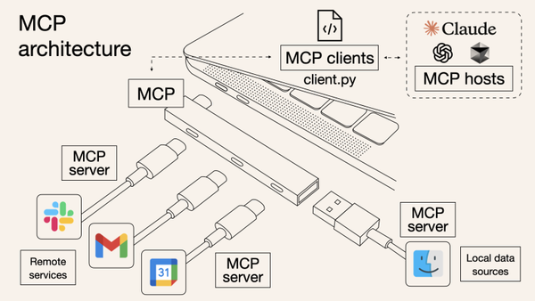
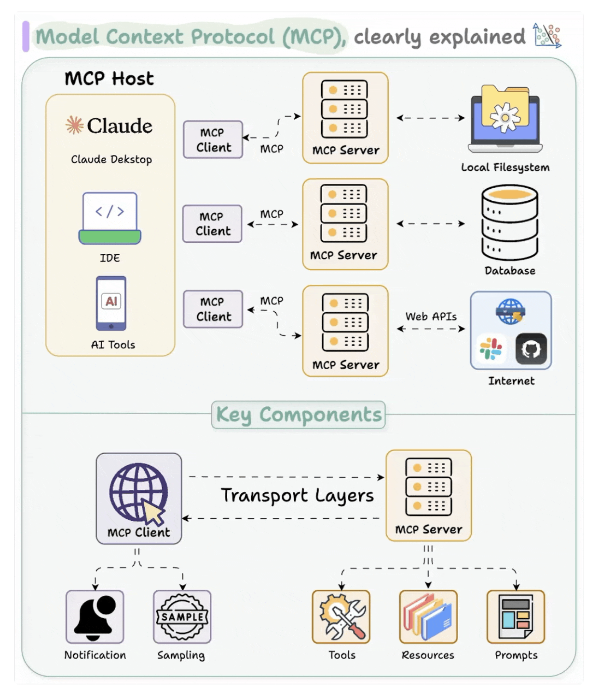
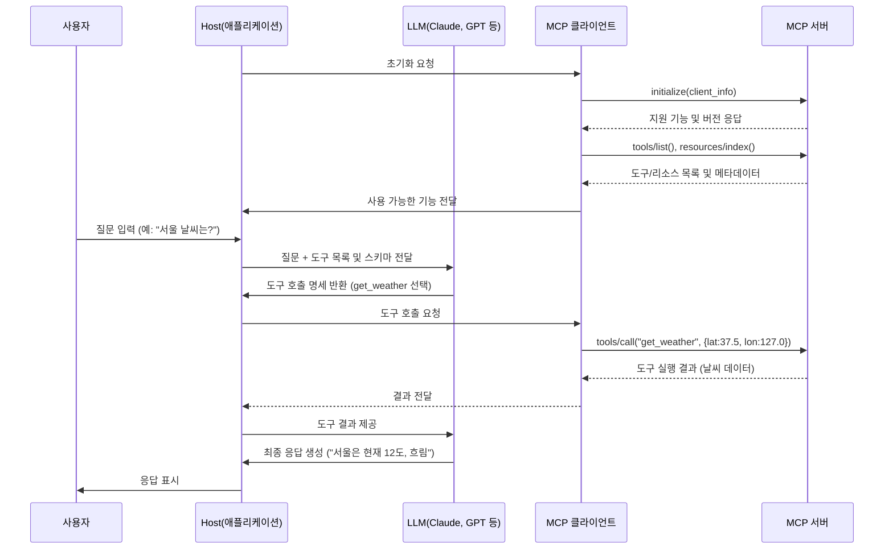

# MCP(Model Context Protocol)란?

MCP는 LLM(Large Language Model) 모델과 외부 데이터 소스 및 도구 간의 안전하고 표준화된 통신을 위한 개방형 프로토콜입니다.

## 1. MCP의 핵심 개념

MCP(Model Context Protocol)는 LLM 모델이 외부 데이터와 도구에 접근할 수 있게 해주는 표준 프로토콜입니다. 여기서 '프로토콜'이란 **서로 다른 시스템이 통신할 때 따르는 규칙과 형식의 집합**을 의미합니다. USB-C가 다양한 기기를 연결하는 것처럼, MCP는 AI 애플리케이션과 다양한 데이터 소스를 연결하는 표준화된 인터페이스를 제공합니다.



MCP의 작동 방식은 마치 컴퓨터와 다양한 주변기기를 연결하는 USB 포트와 유사합니다. 표준화된 인터페이스를 통해 LLM 모델은 Google Drive, Slack, GitHub, Git, Postgres와 같은 다양한 서비스에 쉽게 연결할 수 있습니다. 이러한 서비스들은 각각 독립적인 MCP 서버로 구현되어, AI 호스트 애플리케이션이 필요에 따라 접근할 수 있습니다.

> ### AI애플리케이션 개발자 관점에서의 MCP란?
> 기존에는 LangChain의 `bind_tools()`나 OpenAI API의 `tools` 파라미터로 LLM에 도구를 연결했습니다. 이 방식은 각 도구마다 다른 구현이 필요하고, 새 도구 추가 시 코드 수정이 불가피했습니다.
>
> MCP는 이 문제를 해결합니다. 도구를 표준 프로토콜로 래핑해 서버로 노출시키면, MCP를 지원하는 모든 LLM이 즉시 사용할 수 있습니다. HTTP가 웹의 표준이 된 것처럼, MCP는 LLM 도구 통합의 표준을 지향합니다.
>
> 즉, "도구를 매번 LLM에 바인딩하지 말고, 한 번 MCP 서버로 만들어 모든 LLM이 사용하게 하자"는 것이 MCP의 핵심입니다.

## 2. MCP의 핵심 구성 요소

### 2.1 MCP 아키텍처: Host, Client, Server


#### Host (애플리케이션)
- Claude Desktop, Cursor AI와 같은 사용자 인터페이스 애플리케이션
- LLM을 관리하고 사용자와 AI 모델 간 상호작용 제공
- 내부에 MCP Client를 포함하여 외부 도구와 연결

#### Client (통신 중개자)
- Host 내부에 존재하는 통신 컴포넌트
- MCP Server와의 연결 및 통신 처리 담당
- Server가 제공하는 Tool과 Resource 목록을 탐색하고 호출

#### Server (도구 제공자)
- 외부 시스템 기능을 MCP 프로토콜로 노출하는 독립 서비스
- Google Drive, Slack, 데이터베이스 등 다양한 시스템에 접근 제공
- 하나의 Host가 여러 Server에 동시에 연결하여 다양한 기능을 통합할 수 있음

MCP Server는 세 가지 유형의 컨텍스트 요소를 Host를 통해 LLM에게 제공합니다. 이러한 요소들이 LLM에게 외부 시스템과 상호작용할 수 있는 능력을 부여합니다.

### 2.2 Context 요소

#### Resources (리소스)
- 모델이 참고할 수 있는 읽기 전용 데이터
- URI 형식으로 식별되는 데이터 접근점
- 예: 파일 내용, API 응답, 데이터베이스 조회 결과
- `@mcp.resource("file://{path}")` 형태로 정의

#### Tools (도구)
- LLM이 실제 작업을 수행하고 시스템에 변화를 줄 수 있는 실행 가능한 함수
- 계산 수행, 데이터 검색, 외부 API 호출 등의 기능 제공
- 입력 파라미터와 출력 형식이 명확히 정의됨
- `@mcp.tool()` 데코레이터로 정의

#### Prompts (프롬프트)
- LLM에게 특정 작업 수행 방법을 알려주는 재사용 가능한 템플릿
- 예: 코드 검토, 텍스트 요약, 데이터 분석 등의 정형화된 작업
- `@mcp.prompt()` 데코레이터로 정의

## 3. MCP의 동작 방식

MCP 기반 시스템에서 LLM이 외부 도구를 사용하는 전체 과정을 살펴보겠습니다.

### 3.1 MCP 동작 흐름 개요

MCP 시스템에서 호스트, 클라이언트, 서버 간 통신은 다음 단계로 이루어집니다:

1. **초기화 및 연결**: 호스트 애플리케이션이 MCP 클라이언트를 통해 서버와 연결을 설정합니다.

2. **기능 탐색**: 클라이언트가 서버에서 제공하는 도구와 리소스 목록을 조회합니다.

3. **사용자 입력 처리**: 사용자의 질문이 LLM에 전달되며, LLM은 필요한 도구를 선택합니다.

4. **도구 호출**: 클라이언트가 서버에 도구 호출 요청을 보내고 결과를 받아옵니다.

5. **응답 생성**: LLM이 도구의 결과를 활용해 최종 답변을 생성하고 사용자에게 전달합니다.

### 3.2 상세 흐름 다이어그램
아래 다이어그램은 MCP 기반 애플리케이션의 통신 흐름을 나타냅니다. 

Host는 Cursor AI나 Claude Desktop과 같은 애플리케이션으로, 내부에 MCP Client를 포함하고 있습니다. 

사용자 질문이 입력되면 LLM이 필요한 Tool을 선택하고, MCP Server에서 실행된 결과를 받아 최종 응답을 생성합니다.



### 3.3 단계별 상세 설명

#### 1단계: 초기화 및 연결 설정
호스트 애플리케이션(Claude Desktop, Cursor 등)이 처음 실행될 때, 내부의 MCP 클라이언트는 서버와 연결을 시도합니다. 클라이언트는 `initialize` 메서드를 호출하여 클라이언트 정보와 함께 지원 가능한 기능을 알립니다. 서버는 자신의 버전과 지원하는 기능을 응답하여 호환성을 확인합니다.

```json
// 클라이언트 → 서버: 초기화 요청
{
  "jsonrpc": "2.0",
  "id": 1,
  "method": "initialize",
  "params": { "clientInfo": { "name": "claude-desktop", "version": "1.0.0" } }
}
```

#### 2단계: 기능 탐색 및 등록
연결이 설정되면, 클라이언트는 서버가 제공하는 도구와 리소스 목록을 요청합니다. 서버는 각 도구의 이름, 설명, 입력 형식(스키마)을 포함한 메타데이터를 반환합니다. 예를 들어, 날씨 정보를 제공하는 서버는 다음과 같이 응답할 수 있습니다:

```json
// 서버 → 클라이언트: 도구 목록 응답
{
  "jsonrpc": "2.0",
  "id": 2,
  "result": {
    "tools": [
      {
        "name": "get_weather",
        "description": "특정 위치의 현재 날씨 정보를 제공합니다",
        "inputSchema": {
          "type": "object",
          "properties": {
            "latitude": { "type": "number" },
            "longitude": { "type": "number" }
          },
          "required": ["latitude", "longitude"]
        }
      }
    ]
  }
}
```

클라이언트는 이 정보를 내부 레지스트리에 저장하고, 이후 LLM에게 사용 가능한 도구로 제공합니다.

> *여기서 잠깐: LangChain이나 OpenAI와 비교해보면 이 과정이 `bind_tools()`나 `tools` 파라미터를 통해 직접 LLM에 도구를 바인딩하는 것과 유사합니다. 차이점은 MCP에서는 이 과정이 표준 프로토콜로 자동화되어 있다는 점입니다.*

#### 3단계: 사용자 요청 처리
사용자가 "서울의 현재 날씨는 어떤가요?"와 같은 질문을 입력하면, 호스트 애플리케이션은 이 질문을 LLM에게 전달합니다. 이때 중요한 점은 LLM에게 질문과 함께 사용 가능한 도구 목록과 스키마도 함께 제공한다는 것입니다. 이 정보는 시스템 프롬프트나 도구 정의의 형태로 LLM에 전달됩니다.

#### 4단계: LLM의 도구 선택
LLM은 사용자 질문을 분석하고, 답변에 필요한 정보를 얻기 위해 적절한 도구를 선택합니다. 질문이 날씨에 관한 것이므로, LLM은 "get_weather" 도구를 사용하기로 결정하고 필요한 인자(서울의 위도와 경도)를 지정합니다. 이 결정은 tool_calls 형태로 반환됩니다:

```json
// LLM → 호스트: 도구 호출 명세
{
  "tool_calls": [
    {
      "name": "get_weather",
      "arguments": {
        "latitude": 37.5665,
        "longitude": 126.9780
      }
    }
  ]
}
```

> *이 부분은 OpenAI나 LangChain에서 LLM이 반환하는 tool_calls와 거의 동일합니다. 실제로 MCP는 이러한 기존 패턴을 표준화했다고 볼 수 있습니다. LLM이 직접 도구를 호출하지 않고 호출 명세만 반환한다는 점이 동일합니다.*

LLM 자체는 실제로 도구를 호출하지 않고, 어떤 도구를 호출할지에 대한 명세만 생성합니다.

#### 5단계: 도구 호출 실행
호스트 애플리케이션은 LLM이 선택한 도구 호출 명세를 감지하고, 이를 MCP 클라이언트에 전달합니다. 클라이언트는 이 정보를 바탕으로 MCP 서버에 "tools/call" 요청을 보냅니다:

```json
// 클라이언트 → 서버: 도구 호출 요청
{
  "jsonrpc": "2.0",
  "id": 3,
  "method": "tools/call",
  "params": {
    "name": "get_weather",
    "arguments": {
      "latitude": 37.5665,
      "longitude": 126.9780
    }
  }
}
```
> LangChain의 `AIMessage의 tool_calls`를 통해 Tool을 호출하는 흐름과 유사하다고 생각하면 될 것 같다.

MCP 서버는 요청을 검증하고 서버 내부에서 해당 도구 함수(get_weather)를 실행합니다. 이 함수는 실제로 외부 날씨 API에 접근하여 데이터를 가져올 수 있습니다.

#### 6단계: 결과 반환 및 처리
서버는 도구 실행 결과를 JSON 형태로 클라이언트에 반환합니다:

```json
// 서버 → 클라이언트: 도구(Tool) 실행 결과
{
  "jsonrpc": "2.0",
  "id": 3,
  "result": {
    "content": [
      {
        "type": "text",
        "text": "{\"temperature\": 12, \"conditions\": \"cloudy\", \"humidity\": 85}",
        "annotations": { "audience": ["assistant"] }
      }
    ]
  }
}
```

> *이 결과는 본질적으로 LangChain이나 OpenAI에서의 ToolMessage와 동일한 역할을 합니다. LLM에게 도구 실행 결과를 전달하는 메시지로, MCP에서는 이것이 표준화된 JSON-RPC 응답 형태로 제공됩니다. 
> 
> `"audience": ["assistant"]`는 외부 도구가 실행한 결과를 AI 모델에게만 전달하여, 모델이 이를 기반으로 사용자에게 적절한 응답을 생성할 수 있게 합니다.


클라이언트는 이 결과를 호스트에 전달하고, 호스트는 이를 LLM의 컨텍스트에 추가합니다.

#### 7단계: 최종 응답 생성
LLM은 원래 질문과 도구 실행 결과(날씨 데이터)를 바탕으로 최종 응답을 생성합니다. 예를 들어:
"현재 서울의 기온은 12도이고, 날씨는 흐리며, 습도는 85%입니다."

이 응답은 호스트 애플리케이션을 통해 사용자에게 표시됩니다.

### 3.4 중요한 특징

1. **표준화된 통신**: MCP는 `표준화된 JSON-RPC 프로토콜`을 기반으로 통신합니다.

2. **도구 호출 제어**: LLM이 직접 도구를 실행하는 것이 아니라, 호스트/클라이언트가 이를 중개합니다. 이 과정에서 사용자 승인이나 보안 정책을 적용할 수 있습니다.

3. **동적 발견**: 클라이언트는 서버의 기능을 실시간으로 발견하고 활용할 수 있습니다. 새 도구가 추가되면 자동으로 LLM에게 제공됩니다.

4. **언어/플랫폼 독립성**: MCP는 다양한 프로그래밍 언어와 플랫폼에서 구현 가능하며, 서로 다른 구현체 간에도 원활한 통신이 가능합니다.

> *기존의 OpenAI나 LangChain에서 모든 도구 통합을 애플리케이션 코드 내에서 직접 구현해야 했던 것과 달리, MCP는 도구 제공자와 사용자를 명확하게 분리합니다. 마치 HTTP가 웹 서버와 브라우저 사이의 인터페이스를 표준화했듯이, MCP는 AI와 도구 사이의 인터페이스를 표준화합니다. 이로 인해 도구를 한 번 MCP 서버로 구현해두면 모든 MCP 호환 애플리케이션에서 바로 사용할 수 있다는 큰 장점이 있습니다.*

이러한 MCP의 동작 방식은 LLM이 외부 세계와 더 효과적으로 상호작용할 수 있게 해주며, 개발자는 자신이 전문으로 하는 영역의 도구를 쉽게 AI 에코시스템에 통합할 수 있습니다.

## 4. MCP vs LangChain/LangGraph 프레임워크 비교

### LangChain/LangGraph의 아쉬운 점
- 새로운 도구 추가 및 변경 시 각 애플리케이션 코드를 직접 수정해야 함
- 패키지화는 가능하지만 표준화된 인터페이스가 없어 통합 방식이 일관적이지 않음
- 도구가 특정 프레임워크(LangChain, LangGraph)에 종속되어 이식성이 제한됨

### MCP를 사용시의 이점

MCP는 기존 방식과 비교하여 다음과 같은 이점을 제공합니다:

- **도구의 재사용성**: Tool을 한 번 MCP 서버로 구현하면 Claude, Cursor, 자체 개발 앱 등 모든 MCP 호환 환경에서 사용 가능
- **관심사 분리**: Tool 로직을 독립적인 서버로 분리하여 AI 앱 코드의 복잡도 감소
- **프레임워크 독립성**: 특정 Python 프레임워크에 종속되지 않고 다양한 언어로 구현 가능
- **확장 가능한 생태계**: 커뮤니티에서 개발된 MCP 서버들을 별도 구현 없이 추가 가능

### MCP의 주요 특징

**장점**:
- **표준 프로토콜**: HTTP가 웹 통신을 표준화한 것처럼, MCP는 AI-도구 간 통신 방식을 통일
- **도구와 앱의 분리**: 도구 개발팀과 AI 애플리케이션 개발팀이 독립적으로 작업 가능
- **접근 제어**: 도구의 권한 범위를 명확히 정의하고 중앙에서 관리
- **동적 도구 발견**: 클라이언트가 서버의 기능을 자동으로 탐색하여 통합 코드 간소화

**고려사항**:
- MCP 서버 배포 및 관리에 따른 인프라 복잡성 증가
- 네트워크 의존성 추가로 인한 잠재적 지연 발생 가능
- 아직 초기 단계로 생태계와 도구가 발전 중인 상태

### 개발 워크플로우 비교
- **LangChain 방식**: 도구 로직과 통합 코드가 앱과 함께 존재하며, 각 앱에서 도구 연결 코드 필요
- **MCP 방식**: 도구 로직은 독립된 서버로 분리되고, 앱은 표준 인터페이스로 도구를 발견하고 사용

MCP 방식은 도구와 애플리케이션 간의 결합도를 낮추어, 도구 변경 시 앱 코드 수정이 최소화되고 다양한 팀이 자신의 전문 영역에 집중할 수 있는 환경을 제공합니다. 다만 서버 관리와 네트워크 통신에 대한 추가 고려가 필요합니다.


## 5. MCP 구현 예제: Python SDK 활용
MCP 서버와 클라이언트 개발을 위해 Anthropic에서 [공식 Python SDK](https://github.com/modelcontextprotocol/python-sdk)를 제공합니다. 이 SDK는 MCP 프로토콜의 복잡한 구현을 간소화하고, 서버와 클라이언트를 구현할 수 있게 해줍니다.


### 5.1 간단한 MCP 서버 구현
```python
# simple_server.py
from mcp.server.fastmcp import FastMCP

# MCP 서버 생성
mcp = FastMCP("SimpleDemo")

# 도구 정의
@mcp.tool()
def calculate(expression: str) -> str:
    """간단한 수학 표현식을 계산합니다"""
    try:
        return str(eval(expression))
    except Exception as e:
        return f"계산 오류: {str(e)}"

# 리소스 정의
@mcp.resource("greeting://{name}")
def get_greeting(name: str) -> str:
    """사용자 이름에 맞춘 인사말을 제공합니다"""
    return f"안녕하세요, {name}님! 오늘도 좋은 하루 되세요."

# 서버 실행
if __name__ == "__main__":
    mcp.run()
```

### 5.2 간단한 MCP 클라이언트 구현
```python
# simple_client.py
import asyncio
from mcp import ClientSession, StdioServerParameters
from mcp.client.stdio import stdio_client

async def run_client():
    # 서버 연결 설정
    server_params = StdioServerParameters(
        command="python",
        args=["simple_server.py"]
    )
    
    # 클라이언트 세션 생성 및 연결
    async with stdio_client(server_params) as (read, write):
        async with ClientSession(read, write) as session:
            # 서버와 연결 초기화
            await session.initialize()
            
            # 사용 가능한 도구 목록 확인
            tools = await session.list_tools()
            print(f"사용 가능한 도구: {[tool.name for tool in tools]}")
            
            # 도구 호출 예시
            result = await session.call_tool("calculate", {"expression": "2 + 3 * 4"})
            print(f"계산 결과: {result.content[0].text}")
            
            # 리소스 접근 예시
            content, _ = await session.read_resource("greeting://홍길동")
            print(f"인사말: {content}")

if __name__ == "__main__":
    asyncio.run(run_client())
```

이 예제는 MCP의 기본 개념을 보여줍니다. 서버는 간단한 계산기 도구와 인사말 리소스를 제공하고, 클라이언트는 이 서버에 연결하여 도구를 호출하고 리소스를 읽어옵니다.

## 6. MCP 개발 도구

MCP 서버 개발과 테스트를 위한 다양한 도구가 제공됩니다:

### MCP Inspector
개발 중인 MCP 서버를 테스트하기 위한 웹 기반 도구입니다:
```bash
mcp dev server.py
```
> 이 명령을 실행하면 두 개의 서버가 시작됩니다:
> - **포트 5173**: MCP Inspector의 웹 UI를 제공하는 프론트엔드 서버로, `MCP 호스트 애플리케이션 역할`을 합니다. 웹 브라우저에서 접속하여 서버의 도구와 리소스를 탐색하고 테스트할 수 있습니다.
> - **포트 3000**: 백엔드 API 서버로, `MCP 클라이언트 역할`을 수행합니다. 웹 UI와 실제 MCP 서버(server.py) 사이의 통신을 처리합니다.


### Claude Desktop 통합
개발한 MCP 서버를 실제 사용 환경인 Claude Desktop에 설치합니다:
```bash
mcp install server.py
```

### 직접 실행
MCP 서버를 Inspector나 Claude Desktop 없이 독립적으로 실행합니다:
```bash
python server.py
# 또는
mcp run server.py
```
이 방식은 다른 MCP 호환 애플리케이션이 직접 연결하거나, 커스텀 클라이언트 개발 시 유용합니다.

## 7. 결론

MCP는 LLM 모델과 외부 시스템 간의 통합을 표준화하는 프로토콜로, 다음과 같은 핵심 가치를 제공합니다:

- **관심사 분리**: Tool 로직과 AI 애플리케이션 로직이 명확히 분리되어 각 영역의 개발자가 독립적으로 개발 가능
- **확장성**: 기존 코드 수정 없이 새로운 Tool과 데이터 소스를 지속적으로 추가 가능
- **상호운용성**: 한 번 MCP 서버로 구현된 Tool은 모든 MCP 호환 애플리케이션에서 즉시 활용 가능
- **표준화**: HTTP가 웹을 표준화한 것처럼, MCP는 AI-도구 통신 방식의 표준을 제시

MCP는 현재 Claude Desktop, Cursor, Zed 등 주요 AI 플랫폼에서 지원되고 있으며, 파일 시스템, 데이터베이스, API 통합 등 다양한 서버가 개발되고 있습니다.

이러한 생태계는 AI 애플리케이션의 기능과 활용 범위를 크게 확장할 것으로 예상됩니다.

AI 어플리케이션 개발자 관점에서 본다면, MCP를 사용에 대한 장점을 하나만 뽑자면, 가장 큰 이점은 `Tool(Agent) 개발과 AI 애플리케이션 개발의 분리`를 통해 소스코드의 복잡성을 줄여 개발효율성이 높아질 수 있을 것 같습니다.